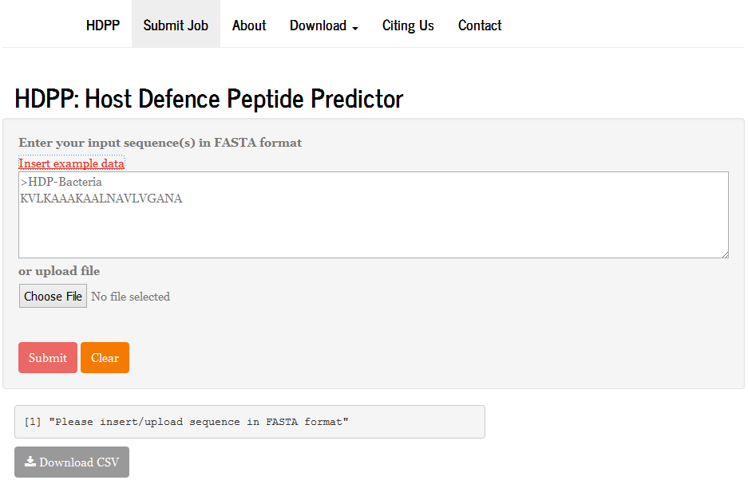

HDPP does not require any knownledge of programming, it is a user--friendly and one-click-to-go online platform for predicting the activity class based on amino acid protein descriptors. This is a short tutorial for using HDPP. 

On the homepage of HDPP:
***

***
First, choose the file's format in which your protein sequences stored. You can copy and paste the file content in a text box to submit. Here, let us assume your protein sequence is the example Input. Click the *Insert Example Data* and the example FASTA will automatically pasted into the text box.
***

***
Predict the activity class of the pasted protein sequence by clicking *Submit* button. After a few seconds, the prediction resutls should appear. 
***

***
Click the  *Download CSV* button to save the predicted results as a csv file. 
***

